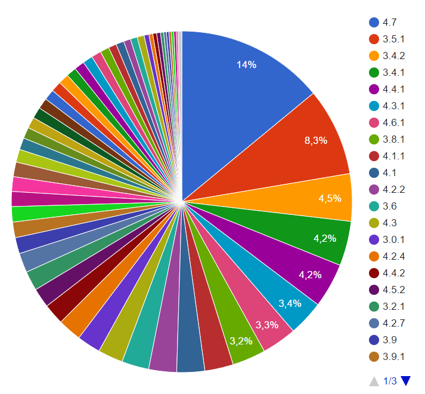
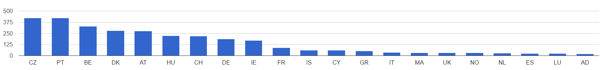
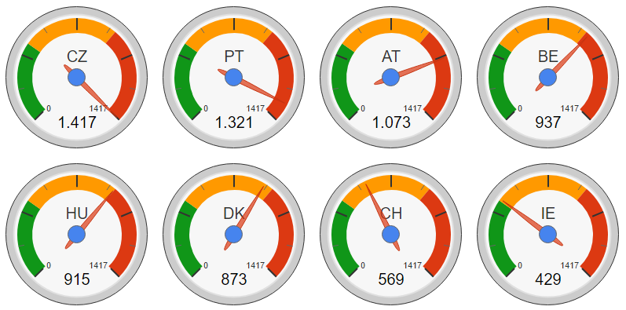
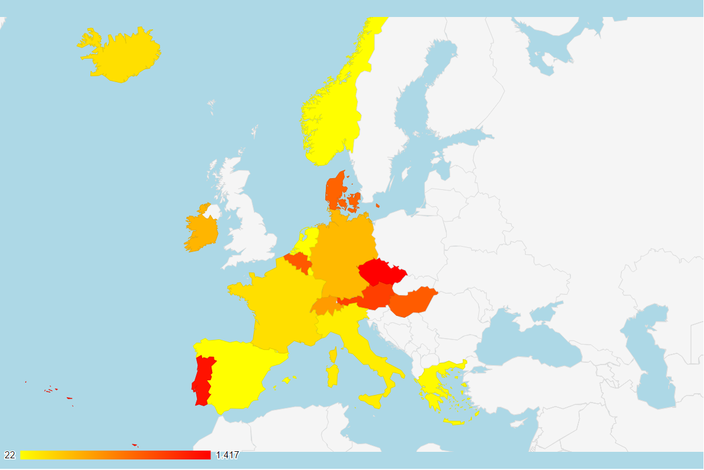

```{r setup, include=FALSE}
knitr::opts_chunk$set(echo = FALSE)
knitr::opts_chunk$set(fig.align = 'center')
```

```{r bootstrap, message=FALSE, warning=FALSE, include=FALSE}
if (!suppressMessages(suppressWarnings(require("plyr", quietly = T)))) {
  suppressMessages(suppressWarnings(install.packages("plyr", repos = "http://cran.rstudio.com/", quiet = T, dependencies = T)))
}
if (!suppressMessages(suppressWarnings(require("dplyr", quietly = T)))) {  
  suppressMessages(suppressWarnings(install.packages("dplyr", repos = "http://cran.rstudio.com/", quiet = T, dependencies = T)))
}
if (!suppressMessages(suppressWarnings(require("ggplot2", quietly = T)))) {
suppressMessages(suppressWarnings(install.packages("ggplot2", repos = "http://cran.rstudio.com/", quiet = T, dependencies = T)))
}
```

``` {r themes, echo=FALSE, eval=FALSE}
themes <- "default", "cerulean", "journal", "flatly", "readable", "spacelab", "united", "cosmo", "lumen", "paper", "sandstone", "simplex", "yeti"
```

# Introduccion 

*WordPress* es el Sistema Gestor de Contenidos (CMS - Content Management System), más usado en Internet. Empezó como una plataforma para la publicación de Blogs pero gracias a un buen soporte y contínuas actualizaciones que mejoran  funcionalidades, usabilidad y seguridad, se ha extendido su uso para la creación de páginas web en general.
Además dispone del apoyo de la comunidad de desarrolladores que ponen a disposición infinidad de temas, plantillas y plugins.

Dentro del ranking mundial, *WordPress* es usado por el 28% de páginas web de todo el mundo, y de todas ellas, de las que usan CMS ocupa el 59% del mercado (como referencia en segundo lugar estaria Joomla con un 7%).


---

#  Objetivo de la práctica

Entre los objetivos de las actualizaciones tanto de la propia plataforma *WordPress* como de sus plugins y temas, está mla de solucionas las vulnerabilidades que se van descubriendo y publicando en cada una de sus versiones.
El objetivo de nuestro estudio es el de conocer en qué versión se encuentra cada página web de la muestra para poder identificar a cuantas vulnerabilidades está expuesta.
Realizando el análisis de datos globalmente, podemos posicionar cada país segun el estado de actualización de sus páginas *WordPress* asignando un nivel de Riesgo para cada país.

Todo ello se realiza a través de un lenguaje con enfoque estadístico llamado R.

[](https://es.wikipedia.org/wiki/R_(lenguaje_de_programaci%F3n))

#  Procedimiento

*  **Extracción de datos**: Para conseguir la lista de URLs *WordPress* con su versión y para cada versión, el listado de vulnerabilidades de cada una.
*  **Procesado con R**: Tratamos los datos para procesar y ordenar dentro de DataFrames.
*  **Graficas de resultados**: Sacamos graficas para entender los resultados de forma visual. 
*  **Conclusiones**: Explicamos las conclusiones que se pueden sacar despues del tratamiento y muestra grafica de resultados.


### Extracción de datos

Para poder conseguir la muestra hacemos una búsqueda a Google.

* aqui explicar un poco como se ha hecho Carlos
* los poblemas que hemos tenido del limite
* alternativas probadas Bing,etc
* soluciones encontradas (por site) y dificultades

```
import re
import json
from bs4 import BeautifulSoup
from scrapy.spiders import Spider
from scrapy.selector import Selector
from urllib.request import urlopen
from urllib.parse import urlparse


class WPSpider(Spider):
    name = 'wpspider'
    allowed_domains = ['www.google.com']
    start_urls = ['https://www.google.es/search?q=%E2%80%9Cindex+of%E2%80%9D+inurl:wp-content&start=' + str(i * 10) for
                  i in range(20)]

    def parse(self, response):
        sel = Selector(response)
        urls = sel.xpath('//h3/a/@href').extract()
        urls = [re.search('q=(.*)&sa', n).group(1) for n in urls]

        data = []
        for url in urls:
            parsed_uri = urlparse(url)
            domain = '{uri.scheme}://{uri.netloc}/'.format(uri=parsed_uri)
            version = get_version(domain)
            print('****Domain:' + domain)
            data.append({'url': domain, 'version': version})

        with open("..\data\data.json", "w") as outfile:
            json.dump({'urls': data}, outfile, indent=4)


def get_version(domain):
    readme = domain + 'readme.html'
    try:
        f = urlopen(readme)
        soup = BeautifulSoup(f.read(), 'html.parser')
        version = soup.find('h1', {'id': 'logo'}).text.split(' ')[2].rstrip()
    except:
        version = '-1'
    return version

```


### Procesado con R

Incorporamos el fichero en formato JSON en el script de R, para convertirlo en un dataframe.
Limpiamos los resultados de la muestra que como es lógico estará **dirty**.
Quitamos las URLs repetidas, las duplicadas y eliminamos las que no hayamos podido obtener su versión. 


```
# Creando objeto json
json_file <- fromJSON("./data/data.json", flatten = TRUE )
is.data.frame(json_file)
str(json_file)

# Creando un Dataframe que contiene todas las URLs de todos los paises
# con campo pais
df_json <-data.frame(do.call("cbind",json_file$urls[[1]]))
df_json_paises <-cbind(df_json,pais=names(json_file$urls[1]))

for(i in 2:length(json_file$urls)) {

  df_json <-data.frame(do.call("cbind",json_file$urls[[i]]))
  df_json_pais <-cbind(df_json,pais=names(json_file$urls[i]))
  df_json_paises <- rbind(df_json_paises,df_json_pais)
}   
    
# Miramos si hay URLs duplicadas
duplicated(df_json_paises)

# Eliminamos las duplicadas que llamaremos Deduplicado
df_json_dedup <- unique(df_json_paises)
print(df_json_dedup)

# Cambiamos las versiones -1 por NA
df_json_dedup$version[which(df_json_dedup$version==-1)]<-NA
```

Hacemos el recuento de resultados y lo llevamos a un dataframe

```
# Sumamos Numero de URLs de cada version
TotalVersionesURLPaises <- count(df_json_dedup, pais, NumVersion = version)
#is.data.frame(TotalVersionesURLPaises)
TotalVersionesURLPaises$pais <- TotalVersionesURLPaises$pais %>% toupper

###
# TotalVersionesURLPaises - Contiene la tabla de (pais, NumVersion, n)
###

TotalVersionesURLPaises_sinna <- TotalVersionesURLPaises[complete.cases(TotalVersionesURLPaises),]

###
# TotalVersionesURLPaises_sinna - Contiene la tabla de (pais, NumVersion, n) todas las URLs con version
###
```

Ahora podemos sacar las versiones que han aparecido en la muestra y extraer los datos de Vulnerabilidades

```
# *****************************
# * Carga de vulnerabilidades *
# *****************************

# Encontrar Lista de Versiones encontradas de URLs de paises para sacar vulns de cada version 
ListaVersiones <- TotalVersionesURLPaises$NumVersion
ListaVersiones <- as.character(ListaVersiones[!is.na(ListaVersiones)])
ListaVersiones = sub("([[:punct:]])","",ListaVersiones)
ListaVersiones = sub("([[:punct:]])","",ListaVersiones)
ListaVersiones <- unique(ListaVersiones)

AllVulns <- list()
#ListaVersiones <- c('47','46','4410','4018','301','31','341','352','3919','41')
for(version in ListaVersiones){
  res <- getURL(url = paste("https://wpvulndb.com/api/v2/wordpresses/", version, sep=""))
  AllVulns <- tryCatch({
    append(AllVulns, fromJSON(res))
  }, error = function(err) {
    print(paste("ERROR in version", i,":",err))
  })
}

# Creacion Tabla de Versiones con Fecha de aparicion de la version y el total de vulns que tiene
df_resum <- data.frame()
df_vulns1version<-as.data.frame(AllVulns[[1]])
df_total <- cbind(ReleaseVersion=as.character.Date(df_vulns1version$release_date[1]),VulnsVersion=length(df_vulns1version$release_date))
df_total <- cbind(df_total,NumVersion=names(AllVulns[1]))
for(i in 2:length(ListaVersiones)) {
  df_vulns1version<-as.data.frame(AllVulns[[i]])
  df_resum <- cbind(ReleaseVersion=as.character.Date(df_vulns1version$release_date[1]),VulnsVersion=length(df_vulns1version$release_date),NumVersion=names(AllVulns[i]))
  df_total<-rbind(df_total,df_resum)
}

TotalVulnsVersion<-as.data.frame(df_total)
TotalVulnsVersion <- unique(TotalVulnsVersion)
# Valores que son Factors los cambiamos para poder tratar y ordenar
TotalVulnsVersion$VulnsVersion <- as.numeric(as.character(TotalVulnsVersion$VulnsVersion))
TotalVulnsVersion$NumVersion <- as.character(TotalVulnsVersion$NumVersion)

###
# TotalVulnsVersion - Contiene la tabla de (ReleaseVersion, VulnsVersion, NumVersion)
###
```

Ahora ya podemos sacar las Tablas finales de resultados

```
#####################
#TABLAS DE RESULTADOS
#####################

print(TotalVersionesURLPaises_sinna)
print(TotalVulnsVersion)

#Tabla con todos los Datos acumulados

TotalVersionesURLVulnsPaises<-merge(TotalVersionesURLPaises_sinna, TotalVulnsVersion, by = "NumVersion")
TotalVersionesURLVulnsPaises <- unique(TotalVersionesURLVulnsPaises)
df_temporal <- tidyr::separate(TotalVersionesURLVulnsPaises, ReleaseVersion, c("YearReleaseVersion","MonthReleaseVersion","DayReleaseVersion"), sep = "-")

TotalVersionesURLVulnsPaises <- cbind(TotalVersionesURLVulnsPaises,AñoPubVersion=as.numeric(df_temporal$YearReleaseVersion))
#str(TotalVersionesURLVulnsPaises)
#TotalVersionesURLVulnsPaises$AñoPubVersion <- as.numeric(TotalVersionesURLVulnsPaises$AñoPubVersion)
#str(TotalVersionesURLVulnsPaises)

# *****************************************
# Tratamos los datos agrupando por Version
# *****************************************
ResulVersionesMundo <- summarise(group_by(TotalVersionesURLVulnsPaises,NumVersion), TotalVerMundo = sum(VulnsVersion))
ResulVersionesMundo <- ResulVersionesMundo[order(-ResulVersionesMundo$TotalVerMundo),] 
# *****************************************

# **************************************
# Tratamos los datos agrupando por Pais
# **************************************
ResulPaises <- summarise(group_by(TotalVersionesURLVulnsPaises,pais), TotalVulnsPais = sum(VulnsVersion))
ResulPaises <- ResulPaises[order(-ResulPaises$TotalVulnsPais),] 
# **************************************

# ***************************************************
# Tratamos los datos agrupando por Pais y año version
# ***************************************************
ResulPaisesAño <- summarise(group_by(TotalVersionesURLVulnsPaises,pais,AñoPubVersion), TotalVulnsPais = sum(VulnsVersion))
ResulPaisesAño <- ResulPaisesAño[order(-ResulPaisesAño$TotalVulnsPais),] 
# ***************************************************

# *************************************************************************************************
# Tratamos los datos agrupando por Pais y año riesgo calculando mayor riesgo si version mas antigua
# *************************************************************************************************
ResulPaisesRiesgoAño <- mutate(ResulPaisesAño,Riesgo=(2017-AñoPubVersion)*TotalVulnsPais)

ResulPaisesRiesgoTotal <- summarise(group_by(ResulPaisesRiesgoAño,pais), TotalRiesgo=sum(Riesgo))
ResulPaisesRiesgoTotal <- ResulPaisesRiesgoTotal[order(-ResulPaisesRiesgoTotal$TotalRiesgo),]
```

### Graficas de resultados

Ahora con los dataframes preparados con los resultados calculados, podemos sacar diferentes graficas


**Tarta con el total de versiones encontradas en la muestra, ordenada por mayor aparición**

```{r tarta, out.width = "500px"}

```

**Grafica de barras con el total de vulnerabilidades totales en cada pais (del total de sus WordPress)**

```{r barras, out.width = "800px"}

```


**Top 8 de Paises con más Riesgo. Calculado según antigüedad de versiones y vulnerabilidades de cada una**

```{r top8, out.width = "500px"}

```

**Mapa de Paises con su Riesgo**

```{r mapa, out.width = "800px"}

```


A continuación el código para sacar las gráficas mostradas:

```
##########
# GRAFICAS
##########
#Carga Librerias
suppressPackageStartupMessages(library(googleVis))
library(MASS)
library(ggplot2)

# --------------
# Tarta de Total de Versiones de Todos los paises
# --------------
Pie <- gvisPieChart(ResulVulnsMundo,options=list(width="1500px", height="1000px"))
plot(Pie)

# ---------------------------------------------------
# Grafica de Barras ordenado por Paises con mas Vulns
# ---------------------------------------------------
Column <- gvisColumnChart(ResulPaises)
plot(Column)

# ---------------------------------------
# Tabla ordenada por Paises con mas Vulns
# ---------------------------------------
PopTable <- gvisTable(ResulPaises,
                      options=list(page='enable',height='automatic',width='automatic'))
plot(PopTable)

# -----------------------
# Top 8 paises mas riesgo
# -----------------------

Media_Riesgo <- as.integer(mean(ResulPaisesRiesgoTotal$TotalRiesgo))
Max_Riesgo <- max(ResulPaisesRiesgoTotal$TotalRiesgo)
Naranja <- ((Max_Riesgo - Media_Riesgo)/2)+ Media_Riesgo
Top <- 8
Gauge <-  gvisGauge(head(ResulPaisesRiesgoTotal,n=Top), 
                    options=list(min=0, max=Max_Riesgo, greenFrom=0,
                                 greenTo=Media_Riesgo, yellowFrom=Media_Riesgo, yellowTo=Naranja,
                                 redFrom=Naranja, redTo=Max_Riesgo, width=800, height=600))
plot(Gauge)

# --------------
# Mapa de Riesgo
# --------------
MapaRiesgo <- gvisGeoChart(ResulPaisesRiesgoTotal, locationvar = "pais", colorvar = "TotalRiesgo", options=list(width="1200px", height="800px", region='150', colorAxis="{colors:['yellow', 'red']}",backgroundColor="lightblue"))
plot(MapaRiesgo)

```


```{r r_logo, out.width = "750px"}
knitr::include_graphics("Captura.png")
```


 
